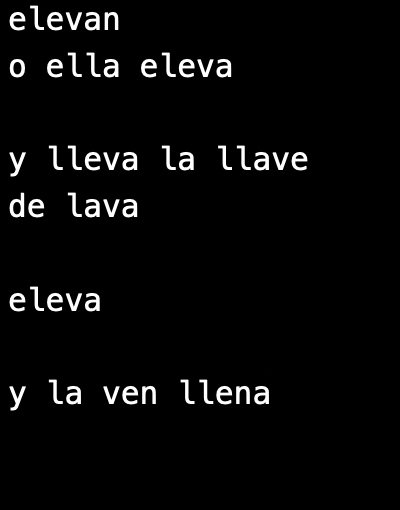

This project evolved into [THIS ONE](https://github.com/solsarratea/catgpt)

# CAblam: Celular Automatas que hablan

Livecoding environment for creating visual effects while writing ASCII characters.

It was built to create an environment language-agnostic for performing.

## How it works
ASCII characters are being interpretated as numbers and updating the CA rules. And special characters are map to control:
- rule threshold
- pixel size
- saturation
- hue

## Constraint Poetry

Used in workshop for generating poetry with letters-constraint given by a initial word.

In the following example **initial word** is `elevan`, only the letters `e` `l` `v` `a` `n` are allowed to be use together with prepositions and conjugations.
Also, each of the following letter has a special role inside the system:

| letter  |  control |
|---|---|
| e  |  rule threshold |  
| l  |  pixel size | 
| v  |  saturation | 
| a  |  hue | 

## Final poem:

